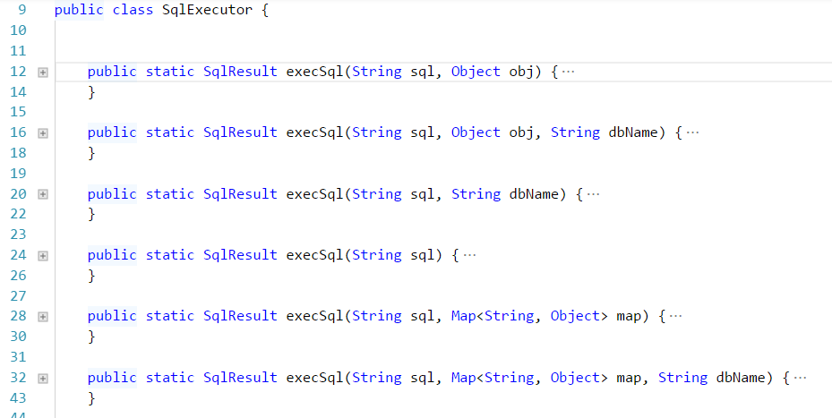

## model的配置
常规的model的写法如下：
``` java
package qeorm.test.model;

import qeorm.ModelBase;
import qeorm.annotation.Column;
import qeorm.annotation.OneToOne;
import qeorm.annotation.Table;

 /**
 * 如果想使用 orm 的话，让model继承qeorm.ModelBase，并且添加@Table 注解，这个model就自动有了以下的功能
  * select 根据当前类的条件筛选数据，返回当前类List
 * selectWithrelation 在select的基础上，也会返回有@OneToOne和@OneToMany的字段的值
 * selectOne 返回一个实例
 * selectOneWithrelation
 * count
 * save
 * insert
 * update 注意，当update时，where条件为  id={id}
 */
@Table(  
    //masterDbName,写库，此配置可以为空，当为空时，默认取当前MODEL命名空间的第三的值+Master 
    masterDbName = "defaultMaster" , 
    //slaveDbName，读库， 规则同 masterDbName
    slaveDbName = "userSlave",
    // tableName ，对应的表的名字，如果为空，默认为 类 的名称
    tableName = "novel",
    // primaryKey 数据库主键字段，如果为空，默认为id
    primaryKey = "id",
    //where, model执行select 、delete 、count时的where条件，如果为空，默认为 id={id}
    where = " id={id} and name like '%{name}%'"
)
public class Novel extends ModelBase {
    //如果字段没有注解，则默认为此字段名称与数据库字段名一致
    // model 字段类型必须为 `大写` 的类型，只有这样，此字段的默认值才为null
    private Integer id;
    private String name;
    //@Column 当数据库字段同model字段名称不相同时，需配置此项
    @Column("name")
    private String myName;
    private String author;
    private Integer tag_id;
    private String desc;
    //@OneToOne 当某字段是另外一个类时，添加此注解，意思是：当前类的【self】字段对应另外一个类的【mapperBy】字段
    //@OneToMany 同上
    @OneToOne(self = "tag_id", mappedBy = "id")
    private Tag tagInfo;
    @OneToOne(self = "id", mappedBy = "id")
    private Novel self;
    // @Transient 当某字段与数据库字段没有对应关系时，字段需加上此注解
    @Transient
    private String other;

    ....
    //以下四个个方法是拦截器，一般用不到
    //给 insert sql 添加ParamIntercept处理器
    public void interceptInsert(SqlConfig sqlConfig) {
        sqlConfig.setParamIntercepts("mobile", new MobileEncoder());
    }
    //给 select sql 添加ParamIntercept处理器
    public void interceptSelect(SqlConfig sqlConfig) {

    }
     //给 update sql 添加ParamIntercept处理器
    public void interceptUpdate(SqlConfig sqlConfig) {

    }
    //执行sql返回数据后，在把数据转化为model之前，可以通过这个方法对数据做一遍处理
    public void intercept(String key, Map<String, Object> rowData, SqlResult sqlResult) {
        rowData.remove("password");        
    }
}

```

## dao用法
``` java
package qeorm.test.news.dao;

import qeorm.test.model.Novel;
import java.util.List;

public interface INovelDao {
    List<Novel> getNovelList(Novel novel);
    //如果参数时基本类型，则必须用 @qeorm.annotation.SqlParam注解标注参数名称
     List<UserStar> list(@SqlParam("userId") Integer userId, @SqlParam("roomIds") Integer[] roomIds);
}
```
对应的xml配置文件的写法
``` xml
<?xml version="1.0" encoding="UTF-8"?>
<!--
根节点 必须 是sqlConfigs
nameSpace：必须，为某个dao的 fullName
dbName：数据库组名称，可以为空，默认为 nameSpace的第三部分，此例中默认为：news
-->
<sqlConfigs dbName="default" nameSpace="qeorm.test.news.dao.INovelDao">

    <!--
    id：必须，对应nameSpace对应的dao的方法名
    dbName：可选，如果此sql为读操作，则默认为 父dbName+Master，如果是写操作，默认为父dbName+Slave

    小贴士：qeorm会自动分析sql语句，判断是读操作还是写操作，然后在相应的 master或slave库上执行
    -->
    <sqlConfig id="getNovelList" >
         <!--
            如果想对参数做一些处理，则可以添加这个配置，也可以添加多个配置
            key : 参数名
            class：处理参数的类，必须实现 qeorm.intercept.IFunIntercept 接口
         -->
        <paramIntercepts>
            <paramIntercept key="uid" class="Qe.Core.paramIntercept.UserParamIntercept"/>
        </paramIntercepts>
        <!--
        qeorm会自行分析{xxx}，当参数中有此参数时，此条件生效，否则会无视此条件
        -->
        <sql>
            <![CDATA[ 
            select * from `novel` where name like '%{name}%' and id in ({ids}) order by {oo}  
            ]]>
        </sql>
        <!--当需要返回嵌套对象时，需要sqlIntercepts配置，可以为空-->
        <sqlIntercepts>
            <!--
            一个 sqlIntercepts 下可以有多个 sqlConfig
            extend:当是select语句时，必须项，有三个可选值，分别为：extend one2One one2Many
            relationKey：必须项，标识对应关系，以本例为例，意思是 父sql的tag_id 和 子sql的id是对应关系
            fillKey：表示本sql返回的数据要填充到父类的哪个字段上，当extend为extend时，此项为空
            -->
            <sqlConfig extend="one2One" relationKey="tag_id|id" fillKey="tagInfo">
                <sql> select * from `tag` where id in ({tag_id}) </sql>
            </sqlConfig>
        </sqlIntercepts>
         <!--
            如果想对sql返回值做一些处理，则可以添加这个配置，也可以添加多个配置
            key : 参数名
            class：处理参数的类，必须实现 qeorm.intercept.IFunIntercept 接口
         -->
        <funIntercepts>
            <funIntercept key="uid" class="Qe.Core.funIntercept.UserFunIntercept"/>
        </funIntercepts>
    </sqlConfig>
</sqlConfigs>
```

## 与spring结合的配置方法
``` xml
    //配置 DataSource，与常规的没有区别，
    <bean id="masterDataSource" class="com.alibaba.druid.pool.DruidDataSource"
          init-method="init" destroy-method="close">
        <property name="url" value="${jdbc.master.url}"/>
        <property name="driverClassName" value="${jdbc.master.driver}"/>
        <property name="username" value="${jdbc.master.username}"/>
        <property name="password" value="${jdbc.master.password}"/>
        .....
    </bean>
    <bean id="slaveDataSource" class="com.alibaba.druid.pool.DruidDataSource"
          init-method="init" destroy-method="close">
          ........
    </bean>
    <bean id="userMasterDataSource" class="com.alibaba.druid.pool.DruidDataSource"
          init-method="init" destroy-method="close">
          ........
    </bean>
    <bean id="userSlaveDataSource" class="com.alibaba.druid.pool.DruidDataSource"
          init-method="init" destroy-method="close">
          ........
    </bean>

    <!--
    用qeorm管理数据库事务
    -->
    <bean class="qeorm.TransactionalManager"/>

    <!--配置qeorm要扫描的接口以及xml文件-->
    <bean class="qeorm.MapperScanner">
        <property name="basePackage" value="com.dankegongyu.**.dao"/>
        <property name="mapperLocations" value="classpath*:com/dankegongyu/**/dao/*.xml"/>
        <!--此项默认为3，可以不配置-->
        <property name="dsIdenty" value="3"/>
    </bean>

    <!--配置 qeorm 需要的数据源-->
    <bean class="qeorm.SqlSession">
        <!-- qeorm 的数据源都是成对出现的，即 xxxMaster  xxxSlave，此项是设置默认的数据库源-->
        <property name="defaultDataSource" value="default"/>
        <property name="dataSources">
            <map>
                <entry key="defaultMaster" value-ref="masterDataSource"/>
                <entry key="defaultSlave" value-ref="slaveDataSource"/>
                <entry key="userSlave" value-ref="userSlaveDataSource"/>
                <entry key="userMaster" value-ref="userSlaveDataSource"/>
                <entry key="ficoMaster"  value-ref="ficoMasterDataSource"/>
				<entry key="ficoSlave"  value-ref="ficoSlaveDataSource"/>
				<entry key="laputaMaster"  value-ref="laputaMasterDataSource"/>
				<entry key="laputaSlave"  value-ref="laputaSlaveDataSource"/>
            </map>
        </property>
    </bean>
```

## 代码中应用事务
只要在相应上方法上添加 `@qeorm.annotation.Transactional` 即可

## 手写sql
某些时候，可能orm 和xml等方式都不能满足需求，需要靠手写sql来实现相关功能，上demo
``` java

     @Autowired
    public qeorm.SqlSession sqlSession;
    //开启事务
    sqlSession.beginTransaction();
    //回滚事务
    sqlSession.beginTransaction();
    //提交事务
    sqlSession.commit();
    //获取spring data 的 jdbcTemplate
    sqlSession.getJdbcTemplate("userMaster")
    //执行sql,sql语句参考 xml 中的sql写法，参数也是用{xxx}标识，也是根据map中是否有有值自动取舍
    qeorm.SqlExecutor.execSql(String sql, Map<String, Object> map, String dbName)
```
 `qeorm.SqlExecutor.execSql` 重载
 

